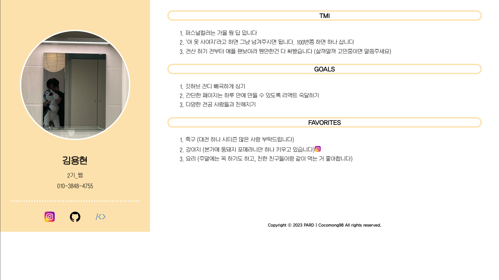
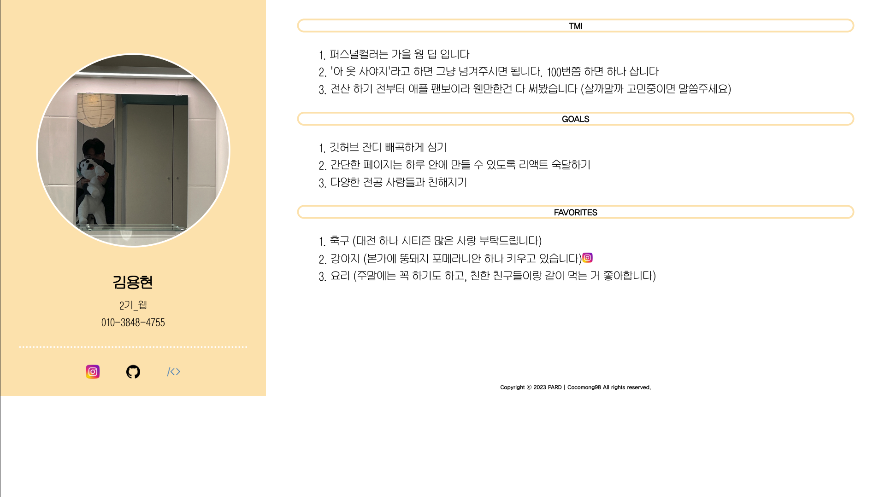

# 과제1 : 자기소개 페이지

## 파일 구조 (간략화)

```
├── public
│   ├── img (사진 파일)
│   └── font (폰트 파일)
└── src
    ├── App.css
    └── App.js
```
가
## 홈페이지 사진

### FHD (1920*1080)


### QHD (2560*1440)


## 요약
- 전반적인 구성은 사진과 개인정보, SNS 링크가 포함된 왼쪽 / TMI, 목표, 좋아하는 것들이 담긴 오른쪽으로 구성되어 있습니다
- 아직 css정도의 수준이라 동적인 기능은 없습니다
- css 구성에 있어서, 반응형 웹 설계를 나중에 생각하다 보니 @media 태그를 뒤늦게 추가하게 되었습니다. 그래서 css 배치 구성이 어지럽게 되었습니다