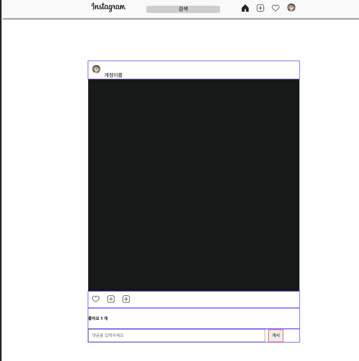
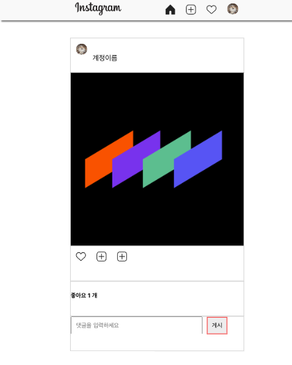
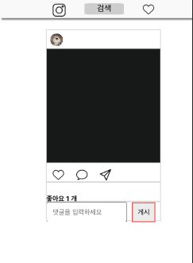

# Instagram HW #4

 - 인스타그램 클론코딩 - context api + mediaquery 

## Screenshot
 - case1:750 이상
  
 - case2:750 이하 450 이상
  
 - case3:450 이하
  

## About Project

 - 리액트를 활용해 인스타그램 웹페이지를 구현하는 프로젝트

## Using

 - Context, Styled-components, ETC..

## Pages

 - 

## 수정

 - 231130 : 전체적인 과제 코드들의 리드미 정리정돈, 페이지의 좌우 너비같은 기초적인 UI정돈 (공통) 
