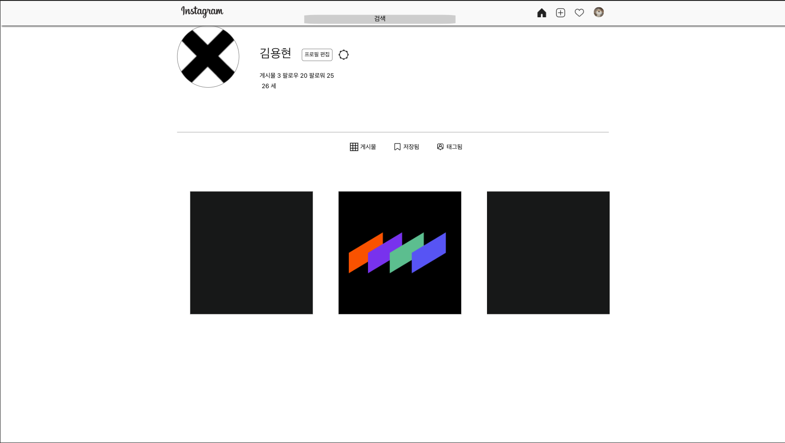
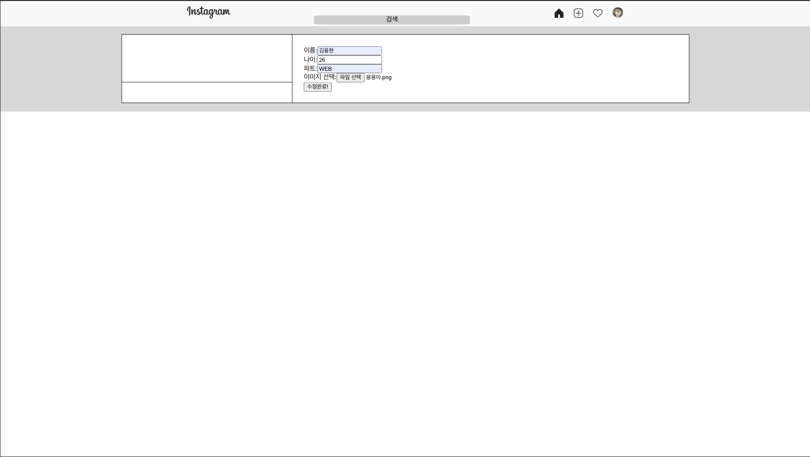
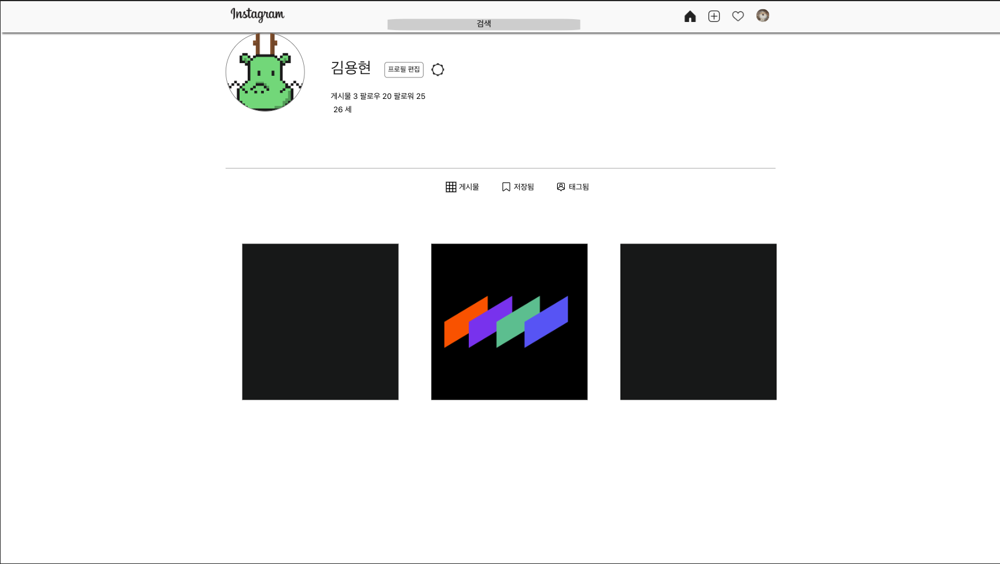

# Instagram HW #5

## Screenshot
 - 최초 실행화면  
  
 - 정보 수정화면  
  
 - 수정된 이후의 화면  
  

## About Project

 - axios 를 사용하여 정보 수정, 이미지 업로드 연습하기

## Using

 - axios

## Pages

 - root : 기본 페이지
 - Edit : 수정 페이지

## 수정

 - 231130 : 전체적인 과제 코드들의 리드미 정리정돈, 페이지의 좌우 너비같은 기초적인 UI정돈 (공통) / 이미지 업로드 부분에서 catch할 때 error처리된 내역도 로그로 볼 수 있도록 해 디버깅에 도움이 되도록 추가 (hw5)
